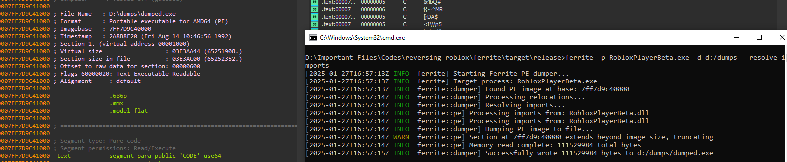

# Ferrite

A PE dumper designed to handle protected executables (mainly Roblox itself).



## Features
- Memory-safe implementation in Rust
- Handles protected and encrypted sections
- Page-by-page memory reading for code sections
- Proper PE header reconstruction
- Import resolution support
- Progress tracking with detailed logging

## Usage

```
ferrite -p <PROCESS_NAME> -d <OUTPUT_DIR> [OPTIONS]
```

### Required Arguments
- `-p, --process`: Name of the target process
- `-d, --output-dir`: Directory where the dumped file will be saved

### Optional Arguments
- `-t, --threshold`: Similarity threshold (default: 0.5)
- `-r, --resolve-imports`: Enable import resolution

### Example
```
ferrite -p RobloxPlayerBeta.exe -d C:/dumps --resolve-imports
```

## How It Works

### Memory Reading
- Code sections are read page by page to handle protected memory
- Non-code sections are read in one go when possible
- Proper memory protection detection and handling
- Skips inaccessible or invalid memory regions

### PE Reconstruction
- Accurate DOS and NT headers reconstruction
- Proper section header alignment and RVAs
- Section characteristics preservation
- Import directory handling
- Proper memory-to-file mapping

### Safety Features
- Memory protection state validation
- Size and boundary checks
- Graceful handling of partial reads
- Protected section handling

## Known Limitations
- Some anti-debug protections may interfere
- Import resolution may be incomplete for heavily protected binaries
- Some sections may be filled with NOPs if unreadable


####
- IT DOES NOT MODIFY MEM PROTECTIONS

## Building

```bash
cargo build --release
```

### INSPIRED BY
[Atrexus - Vulkan](https://github.com/atrexus/vulkan)