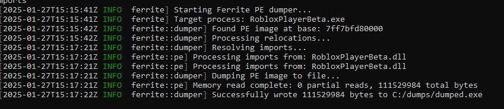
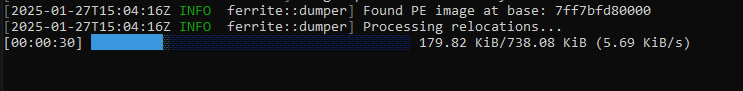

# Ferrite

A PE dumper designed to handle protected executables (mainly Roblox itself).



## Usage

```
ferrite -p <PROCESS_NAME> -d <OUTPUT_DIR> [OPTIONS]
```

### Required Arguments
- `-p, --process`: Name of the target process
- `-d, --output-dir`: Directory where the dumped file will be saved

### Optional Arguments
- `-t, --threshold`: Similarity threshold (default: 0.5)
- `-r, --resolve-imports`: Enable import resolution

### Example
```
ferrite -p RobloxPlayerBeta.exe -d C:/dumps --resolve-imports
```

## How to use

Run it from the command line:

```bash
ferrite -p <TARGET_PROCESS> -o <OUTPUT_FILE> --resolve-imports
```

If no output file is specified, the file will be saved to the current directory.

### Decryption

Ferrite will attempt to decrypt protected memory regions by reading and writing back memory pages. Due to the nature of some protections, there might always be unreadable pages, so decryption could encounter partial reads. For best results, wait until at least 50% of the module is processed.

You can control the decryption behavior using the `-t` or `--threshold` option with a value from `0.0` to `1.0`:
```bash
ferrite -p <TARGET_PROCESS> --threshold 0.5
```

### Import Resolution

To reconstruct the import table for the main module, use the `-i` or `--resolve-imports` flag. This will locate and rebuild the import directory in memory. Note that this only affects the main module:
```bash
ferrite -p <TARGET_PROCESS> --resolve-imports
```

# TO-DO
- Improve the dumping process
- Add debug logs for nerds like me
- Split pe.rs into parts cause editing it in one-file is a pain in the ass

### INSPIRED BY
[Atrexus - Vulkan](https://github.com/atrexus/vulkan)